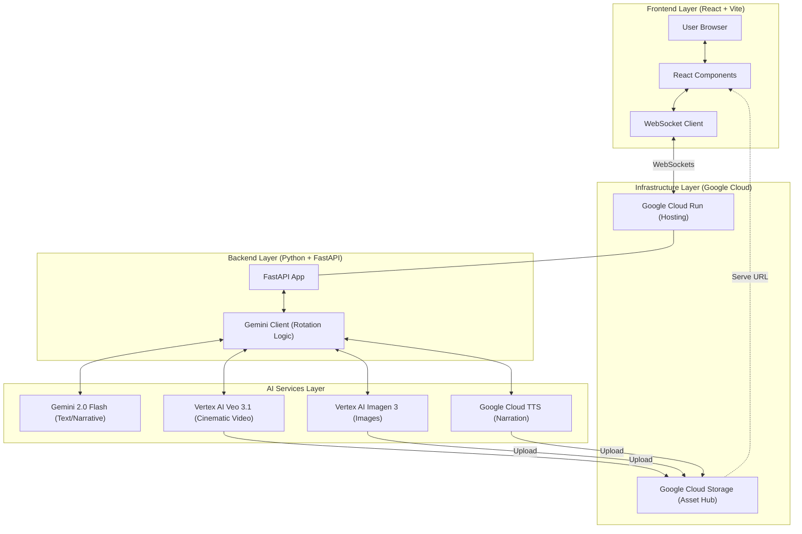

# TaleForge 🎬✨

TaleForge is an advanced, AI-powered multimodal creative engine that acts as your personal **Creative Director & Analyst**. It generates immersive, mixed-media narratives, workflows, marketing assets, and diagrams as a real-time, fluid stream.

Powered by the **Google Genesis-Stack** (Vertex AI Native) and the **Miro REST API**, TaleForge identifies your vision and brings it to life with professional-grade content and diagrams.

---

## 🌍 Live Deployment

TaleForge is now deployed on **Google Cloud Run** for high-availability and serverless scaling:

- **Frontend App**: [https://taleforge-frontend-y7waogt4oa-uc.a.run.app](https://taleforge-frontend-y7waogt4oa-uc.a.run.app)
- **Backend API**: [https://taleforge-backend-y7waogt4oa-uc.a.run.app](https://taleforge-backend-y7waogt4oa-uc.a.run.app)

---

## 🌟 Generation Modes

TaleForge supports specialized modes to tailor prompt engineering and asset generation to your specific needs:
- **📖 Storybook**: Narrative storytelling with cinematic art and background elements.
- **📈 Marketing Campaign**: Elite ad copy, hero product photography, and promotional lifestyle videos.
- **🎓 Educational Explainer**: Instructional analogies and step-by-step explanations paired with concept maps.
- **📊 Pitch Deck**: Business architecture and value chain workflows plotted live.
- **⚙️ Workflow Planning**: Standardized flowcharts and process diagrams.
- **📱 Social Media Post**: Viral hooks, vertical aesthetic photography, and hashtags optimized for feed engagement.

---

## 🌌 Multimodal Narrative Engine

Experience structured content as it unfolds with interleaved assets:
- **Vertex AI Imagen 3**: Photorealistic scene art and high-end imagery.
- **Vertex AI Veo 3.1**: High-fidelity cinematic motion clips woven into key story beats.
- **Google Cloud TTS**: High-end **Neural2/Studio** voices for multi-character acting and synchronized narration.
- **High-Availability Mapping**: Automatic platform-aware model routing (e.g., Vertex ID alignment for Gemini 2.0/2.5).
- **Synchronized Cinematics**: Unified playback engine that keeps cinematic visuals perfectly in sync with the narration.
- **Instant Accessibility**: Direct GCS public-read narration delivery for zero-latency playback.

---

## 📂 Project Structure

```text
TaleForge/
├── backend/                # FastAPI Application
│   ├── main.py            # API Entry point & WebSocket handler
│   ├── gemini_client.py    # Multi-client rotation & AI integration
│   ├── database.py         # Cloudflare D1 integration
│   ├── Dockerfile          # Production container config
│   └── requirements.txt    # Python dependencies
├── frontend/               # React + TypeScript App
│   ├── src/               # UI Components & Logic
│   ├── public/            # Static assets
│   ├── Dockerfile         # Frontend container config
│   └── package.json        # Node dependencies
├── TaleForge_Architecture.md # Mermaid source for diagrams
├── TaleForge_Story.txt      # Project narrative & tech details
└── README.md                # Project documentation
```

---

## 🏗️ Technical Architecture

- **Backend**: Python (FastAPI), Google Gen AI SDK, Miro REST API, Docker.
- **Frontend**: React (Vite) + TypeScript + Vanilla CSS.
- **GenAI Suite**: Gemini 2.0 Flash / 2.5 Pro (via robust multi-client rotation).
- **Vision**: Vertex AI Imagen 3 & Veo 3.1.
- **Audio**: Google Cloud Text-to-Speech (Neural2/Studio Engine).
- **Hosting**: Google Cloud Run + Artifact Registry.
- **CI/CD**: Google Cloud Build & Artifact Registry.
TaleForge uses a streaming multimodal architecture to deliver content in real-time.



---

## 🚀 Getting Started

### 1. Prerequisites
- Python 3.10+
- Node.js 18+
- Google Cloud Project with Vertex AI and GCS enabled.
- Docker (for containerization and testing).

### 2. Local Environment Configuration
Create a `.env` file in the `backend/` directory:
```env
GOOGLE_CLOUD_PROJECT=your-project-id
GOOGLE_CLOUD_LOCATION=us-central1
GEMINI_API_KEY_1=your-api-key
# Add up to GEMINI_API_KEY_5 for high-availability rotation
```

### 3. Backend Setup
```powershell
cd backend
pip install -r requirements.txt
python -m uvicorn main:app --reload
```

### 4. Frontend Setup
```powershell
cd frontend
npm install
npm run dev
```

### 5. Deployment to Cloud Run
To deploy the application to your own Google Cloud project:
```powershell
# Deploy Backend
cd backend
gcloud run deploy taleforge-backend --source . --region us-central1 --allow-unauthenticated

# Deploy Frontend
cd frontend
# Ensure .env.production has your backend URL
gcloud run deploy taleforge-frontend --source . --region us-central1 --allow-unauthenticated
```

---

## 🎭 Usage
1. Open TaleForge in your browser.
2. Select your **Generation Mode** (e.g., Storybook, Marketing Campaign).
3. Enter your prompt or use the **"Surprise Me"** button.
4. Add **Keywords** to ground the AI's creative direction.
5. Click **Forge Story** and watch your vision turn into structured multimedia.

---

Built with ❤️ by **SHADOW**.
